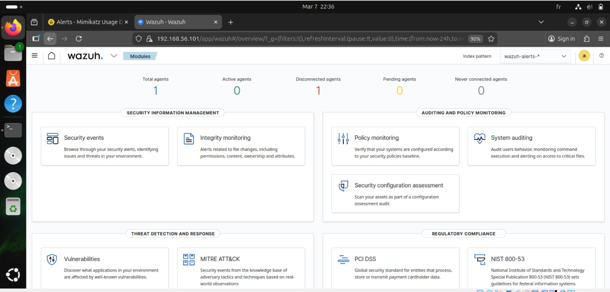
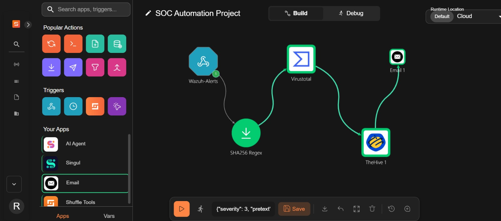
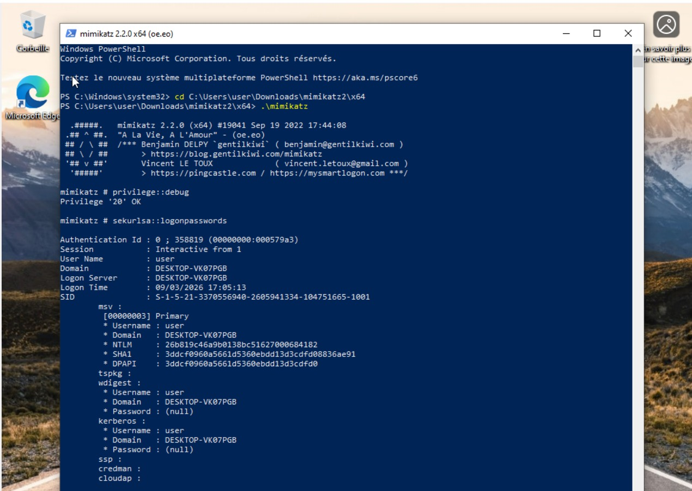
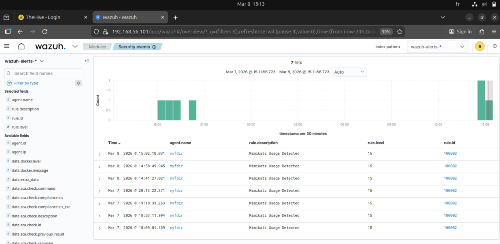
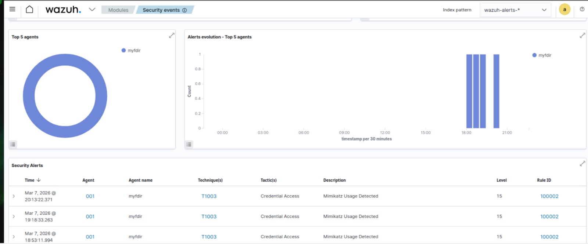
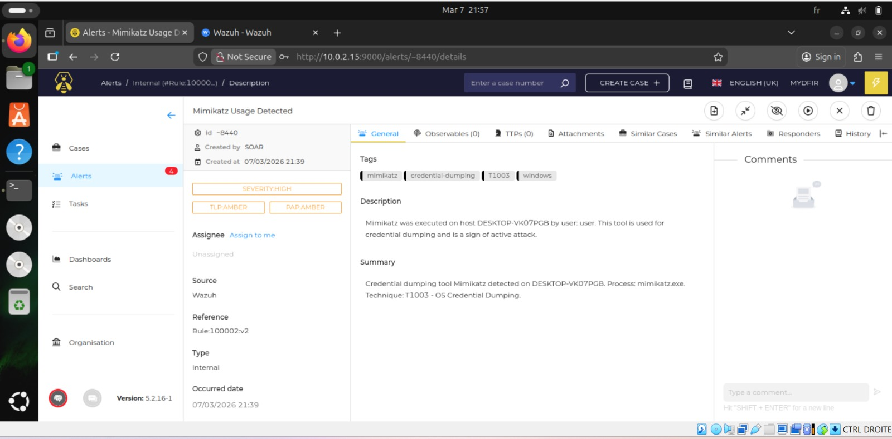
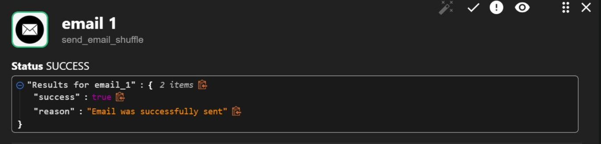
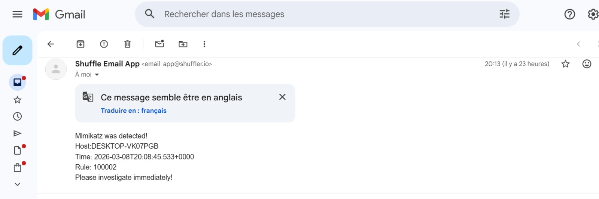

#  SOC Automation Home Lab

-Automated SOC Home Lab with Wazuh, TheHive, Shuffle and Mimikatz

---

##  Project Overview

This project is a fully automated **Security Operations Center (SOC)** built from scratch using a home lab environment. The goal is to simulate a real-world SOC workflow where a cyber attack is automatically detected, investigated, and reported — all within seconds.

---

##  Objectives

- Detect malicious activity (Mimikatz) on a Windows machine
- Automatically generate alerts using a SIEM
- Automate incident response using SOAR
- Create investigation cases in a Case Management platform
- Notify the SOC Analyst via email

---

##  Lab Architecture

### Virtual Machines

**Windows 10 VM —> demo** (192.168.56.102)
- Sysmon : monitors all system events
- Wazuh Agent : sends events to Wazuh Manager
- Mimikatz : attack simulation tool

**Ubuntu VM —> ubunntu** (192.168.56.101)
- Wazuh Manager : receives and analyzes alerts
- Wazuh Dashboard : visualizes security events
- TheHive (Docker) : case management platform

**Cloud / External**
- Shuffle (shuffler.io) : SOAR automation
- VirusTotal API : file reputation check

---

##  Tools Used

**Wazuh 4.7.5** : (SIEM - Threat Detection)  
**Sysmon** : Windows Event Monitoring  
**TheHive 5.2** : Case Management  
**Shuffle** : (SOAR - Automation)  
**VirusTotal API v3** : File Reputation Check  
**Mimikatz 2.2.0** : Attack Simulation  
**VirtualBox 7.1** : Virtualization  
**Docker** : TheHive Container  

---

##  Automated Workflow

1️⃣ Mimikatz executed on Windows 10  
2️⃣ Sysmon captures the event (EventID 1 - Process Create)  
3️⃣ Wazuh Agent sends event to Wazuh Manager  
4️⃣ Wazuh Rule 100002 triggers alert (Level 15 - Critical)  
5️⃣ Shuffle receives the alert via Webhook  
6️⃣ VirusTotal checks the file hash reputation  
7️⃣ TheHive creates an investigation case  
8️⃣ SOC Analyst receives email notification

---

##  Installation & Configuration Steps

### Step 1 — Wazuh Installation (Ubuntu)

```bash
curl -sO https://packages.wazuh.com/4.7/wazuh-install.sh
curl -sO https://packages.wazuh.com/4.7/config.yml
bash wazuh-install.sh -a
```

**Access:** `https://192.168.56.101`

---

### Step 2 — Wazuh Agent Registration (Windows 10)

After installing the Wazuh Agent on Windows 10, the agent appears in the Wazuh dashboard as active.



```powershell
Invoke-WebRequest -Uri https://packages.wazuh.com/4.x/windows/wazuh-agent-4.7.5-1.msi -OutFile ${env:tmp}\wazuh-agent.msi
msiexec.exe /i ${env:tmp}\wazuh-agent.msi /q WAZUH_MANAGER='192.168.56.101' WAZUH_AGENT_NAME='mydfir' WAZUH_REGISTRATION_SERVER='192.168.56.101'
net start wazuhsvc
```

---

### Step 3 — Sysmon Installation (Windows 10)

```powershell
Invoke-WebRequest -Uri "https://raw.githubusercontent.com/SwiftOnSecurity/sysmon-config/master/sysmonconfig-export.xml" -OutFile "sysmonconfig.xml"
.\Sysmon64.exe -accepteula -i sysmonconfig.xml
```

Add to `C:\Program Files (x86)\ossec-agent\ossec.conf`:
```xml
<localfile>
  <location>Microsoft-Windows-Sysmon/Operational</location>
  <log_format>eventchannel</log_format>
</localfile>
```

---

### Step 4 — Custom Wazuh Rule for Mimikatz Detection

Edit `/var/ossec/etc/rules/local_rules.xml`:
```xml
<group name="local,syslog,sshd,">
  <rule id="100002" level="15">
    <if_group>sysmon_event1</if_group>
    <field name="win.eventdata.originalFileName" type="pcre2">(?i)mimikatz\.exe</field>
    <description>Mimikatz Usage Detected</description>
    <mitre>
      <id>T1003</id>
    </mitre>
  </rule>
</group>
```

```bash
sudo systemctl restart wazuh-manager
```

---

### Step 5 — TheHive Installation via Docker (Ubuntu)

```bash
mkdir ~/thehive && cd ~/thehive
sudo docker-compose up -d
```

**Access:** `http://10.0.2.15:9000`  
**Credentials:** admin@thehive.local / secret

---

### Step 6 — Shuffle SOAR Workflow Configuration

The Shuffle workflow automatically connects Wazuh alerts to VirusTotal, TheHive and Email.



Configure Wazuh → Shuffle integration in `/var/ossec/etc/ossec.conf`:
```xml
<integration>
  <name>shuffle</name>
  <hook_url>YOUR_SHUFFLE_WEBHOOK_URL</hook_url>
  <rule_id>100002</rule_id>
  <alert_format>json</alert_format>
</integration>
```

---

##  Attack Simulation

### Step 1 — Disable Windows Defender (for testing only)
```powershell
Set-MpPreference -DisableRealtimeMonitoring $true
Set-MpPreference -DisableIOAVProtection $true
```

### Step 2 — Execute Mimikatz

Mimikatz is executed on the Windows 10 VM to simulate a credential dumping attack (MITRE T1003).



```powershell
cd C:\Users\user\Downloads\mimikatz2\x64
.\mimikatz.exe
```
```
privilege::debug
sekurlsa::logonpasswords
exit
```

---

##  Results

### Wazuh Detects Mimikatz

Wazuh successfully detected Mimikatz using Sysmon EventID 1 (Process Create).



---

### Wazuh Dashboard — Critical Alerts

The Wazuh dashboard shows multiple critical alerts for Mimikatz on agent **mydfir** with Rule ID 100002, Level 15, MITRE Technique T1003.



---

### TheHive — Investigation Case Created

An investigation case was automatically created in TheHive with full details of the attack.



---

### SOC Analyst Email Notification

The SOC Analyst received an automatic email notification with all attack details for immediate investigation.






---

##  Key Concepts

**SIEM** — Security Information and Event Management  
**SOAR** — Security Orchestration, Automation and Response  
**EDR** — Endpoint Detection and Response  
**T1003** — MITRE ATT&CK - OS Credential Dumping  
**EventID 1** — Sysmon - Process Creation  
**Hash SHA256** — Unique file fingerprint  
**Rule 100002** — Custom Wazuh rule for Mimikatz detection  
**Level 15** — Maximum alert severity in Wazuh  

---

## 🔗 Resources

- [Wazuh Documentation](https://documentation.wazuh.com)
- [TheHive Project](https://thehive-project.org)
- [Shuffle Documentation](https://shuffler.io/docs)
- [Sysmon Config](https://github.com/SwiftOnSecurity/sysmon-config)
- [MITRE ATT&CK T1003](https://attack.mitre.org/techniques/T1003/)

---

## 👤 Author

**RIM522** — Cybersecurity Enthusiast  
🔗 [GitHub](https://github.com/RIM522)

---

This project was built as part of a cybersecurity home lab 
to develop real-world SOC skills.

